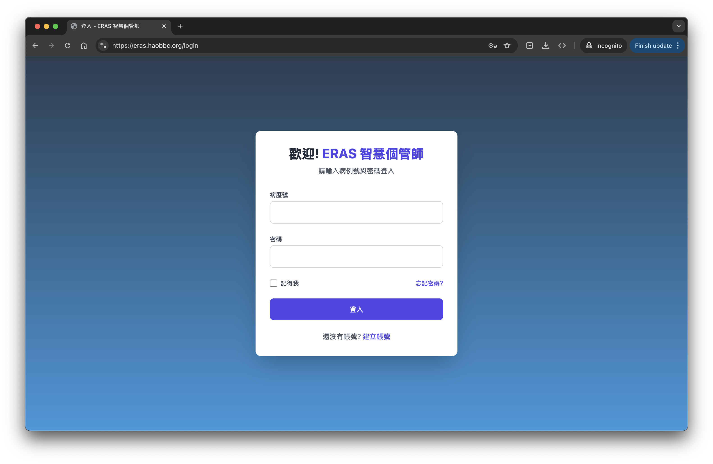
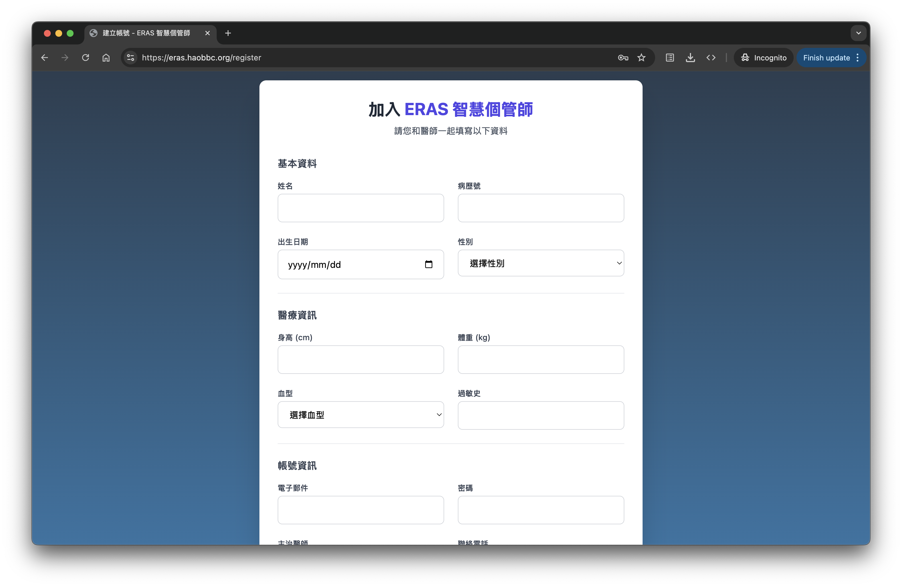
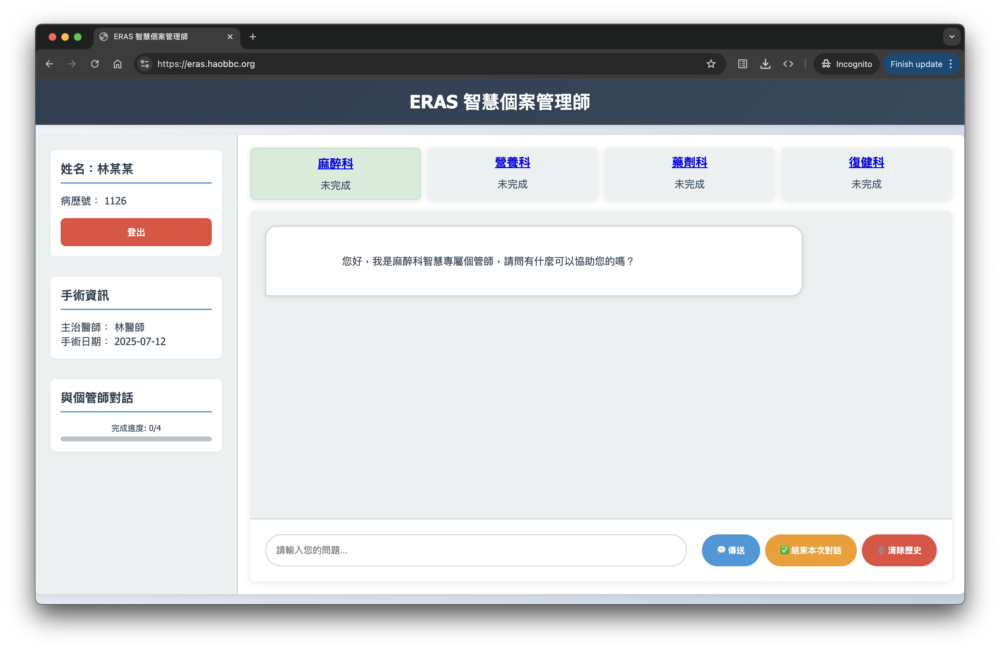
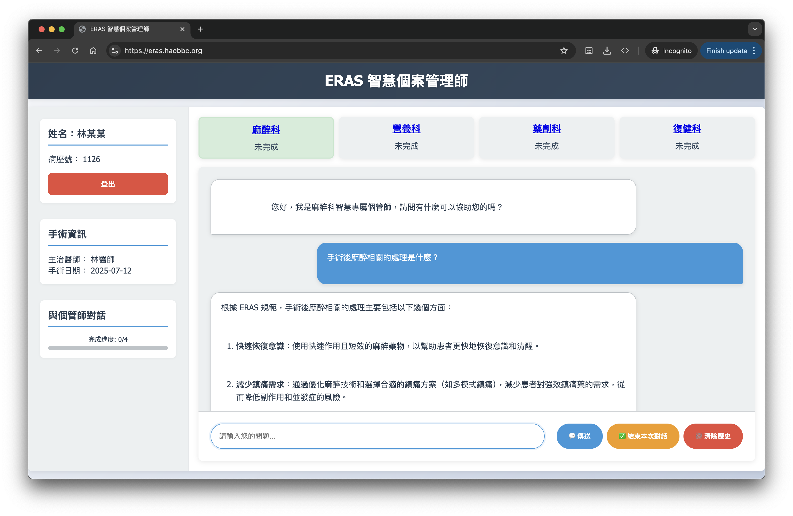
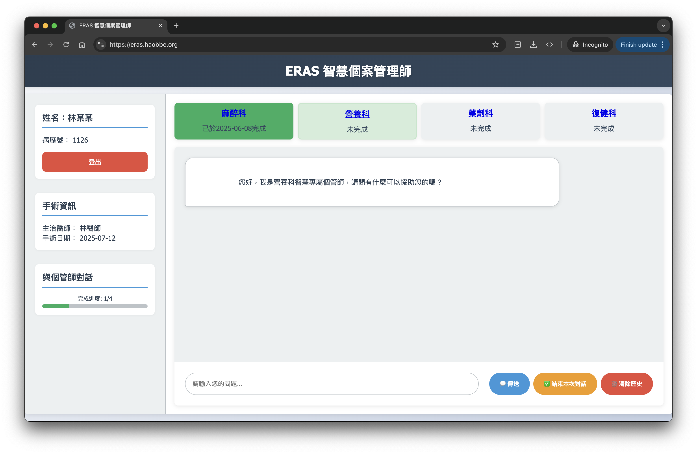

# ERAS 醫療專案管理系統

## 介紹

隨著實證醫學的發展，現行醫療服務中的治療指引與臨床路徑（如 ERAS 術後加速復原計畫）日益完善。然而，這些指引往往過於敘述化，執行上高度依賴多團隊協作（營養師、護理、復健科、麻醉科、手術醫師等）。在人力不足或醫療資源有限的環境中，繁瑣的規章與分散的執行流程導致項目難以完整實現。目前，ERAS 計畫依賴專人管理和聯繫，難以實現自動化與整合。

---

## 目標

- 建立一個結合 LLM 的 ERAS 衛教與任務管理平台
- 提供病患導向的互動式 To-Do List 與 QA 系統
- 整合多團隊工作流程與指引，實現數位化管理
- 發展影像問答（VQA）功能，支援圖像解釋

---

## 系統功能模組

### 前台（Web）

- **病患登入頁面**
  - 建立帳號 / 登入帳號
- **聊天頁面**
  - 向專家 LLM 提問 / 對話
  - 紀錄當前與各科別完成進度

### 病患互動模組

- **ERAS 指引與 QA**
  - LLM + RAG/Fine-tune 模型導入 ERAS 指引
  - 提供即時衛教與常見問答

- **擴充 QA 模組**
  - 提供 ERAS 術前、中、後全面資訊
  - 提示式問題設計，引導快速查詢

- **視覺問答（VQA）[次階段]**
  - 術後影像搭配報告進行 LLM 解釋
  - 強化圖像解釋與醫病溝通品質

---

## 系統結構簡述

```
.
├── app.py                     # 主應用程式
├── apps/                      # RAG 與 LLM 相關腳本
│   ├── RAG\_NAIVE.py
│   └── ...
├── templates/                # HTML 前端模板
│   ├── login.html
│   └── ...
├── docs/                     # 指引與會議記錄
│   ├── guidance.md
│   └── meeting_2025-04-22.md
├── PDFS/                     # 上傳的 ERAS PDF 文件
├── TXTS/                     # 預處理後文字檔案
├── VectorDB/                 # 向量資料庫（chroma）
├── requirements.txt          # 環境依賴
└── README.md

```

---

## 使用說明

### 文件上傳

- **PDF**：請將 ERAS 指引與衛教相關 PDF 放入 `/PDFS/` 目錄。
- **Markdown**：請將會議記錄與計畫指引等 `.md` 文件放入 `/docs/` 目錄。

### 前端存取網址

- Web 主介面：[https://eras.haobbc.org](https://eras.haobbc.org)

> ⚠️ 當前部署於本地伺服器：AMD 98003DX / RAM 64GB / RTX 5090

---

## 本地端架設

### 1. Git clone
```bash
git clone https://github.com/Gary20011207/Med-EECS_LLM.git
cd Med-EECS_LLM
```

### 2. 建立環境
可以使用 conda 或是 venv  
**conda:**
```
conda create -n langchain-rag python=3.10 -y
conda activate langchain-rag
pip install -r requirements.txt
```
**venv:**
```
python3 -m venv .venv
source .venv/bin/activate
pip install -r requirements.txt
```

### 3. 啟動網頁伺服器
```
python3 app.py
```
第一次執行的時候會自動建立 VectorDB（向量資料庫）和 `chat.db`（使用者資料庫）

---

## 專案進度

- 架構設計與資料結構已完成
- 初步 RAG 實作（`apps/RAG_NAIVE.py`）
- 前端模板基本設計
- VQA 與 LLM Fine-tuning 功能開發中

### 登入頁面


### 註冊頁面


### 聊天頁面

1. 主頁面


2. 可以跟專家 LLM 對話


3. 對話完成後，可以點選完成，跟下一位專家 LLM 繼續對話


---

## 分工概述

- **前端**：Web 介面設計與 HTML 編排
- **後端**：LLM / RAG 整合與推論實作
- **模型工程**：模型選擇、調參與微調
- **文件管理**：維護 `/docs/` 中的會議與技術文件
- **論文整理**：搜尋相關指引並文字化整理於 `/PDFS/` 及 `/TXTS/` 
- **自訂QA**：整理常見問題及標準答案
- **影像蒐集**：蒐集術後影像及對應報告 


| 組員 | 主要負責內容 |
| --- | --- |
| 傅冠豪 | 概念發想、組織架構 |
| 金哲安 | 網頁前端、網頁後端 |
| 陳孟潔 | 網頁前端、網頁後端 |
| 陳冠宇 | LLM 系統架構整合 (RAG、LoRA)、QA 及 VQA 集評估、簡報、書面報告 |
| 楊哲瑜 | QA 集設計、查找、整理 |
| 倪昕 | QA 集設計、查找、整理、書面報告 |
| 張玠 | 一點QA 集、Prompt 設計、查找、整理、簡報 |
---

## 書面報告
- [智慧醫療對話系統_ERAS輔助應用_書面報告](./docs/智慧醫療對話系統_ERAS輔助應用_書面報告.pdf)

## 近期會議

- [2025/05/13](./docs/2025-05-13-meeting.md)
- [2025/05/20](./docs/2025-05-20-meeting.md)

